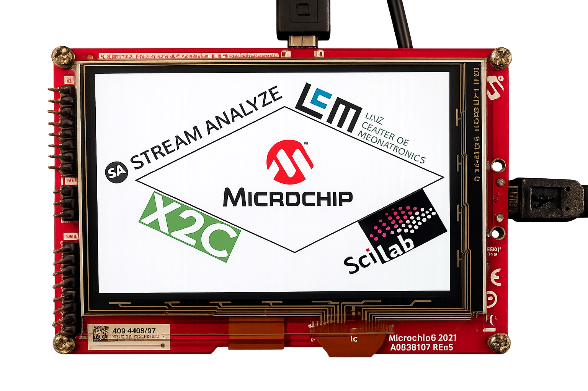

# IGaT Display (EV14C17A) Firmware

This folder is for the Integrated Graphics and Touch (IGaT) Curiosity Evaluation Kit
(EV14C17A) display firmware used alongside the Dyno. The IGaT board is separate
hardware from the dyno controller and is programmed independently.

The IGaT display HEX file is in "MCHPDyno/igat_ev14c17a/doc/standalone/ATSAME51J20A_MCHP_Dyno_08_01_2026_IGAT.hex"

Currently the IGAT is only used as a display, but feel free to modify the code, such to be able to use it as a controller for the Dyno or motor.

## Programming (Standalone)

1. Connect directly with a microUSB cable to the debug port of the EV14C17A board.
2. In MPLAB IPE, select the ATSAME51PJ20A device on the kit.
3. Program the HEX from `doc/standalone/`.
4. Reset the board to run the UI.

## Final Result

The logos represent the different tools used for making the MC-Dyno. 

More info on the kit: https://www.microchip.com/en-us/development-tool/ev14c17a
