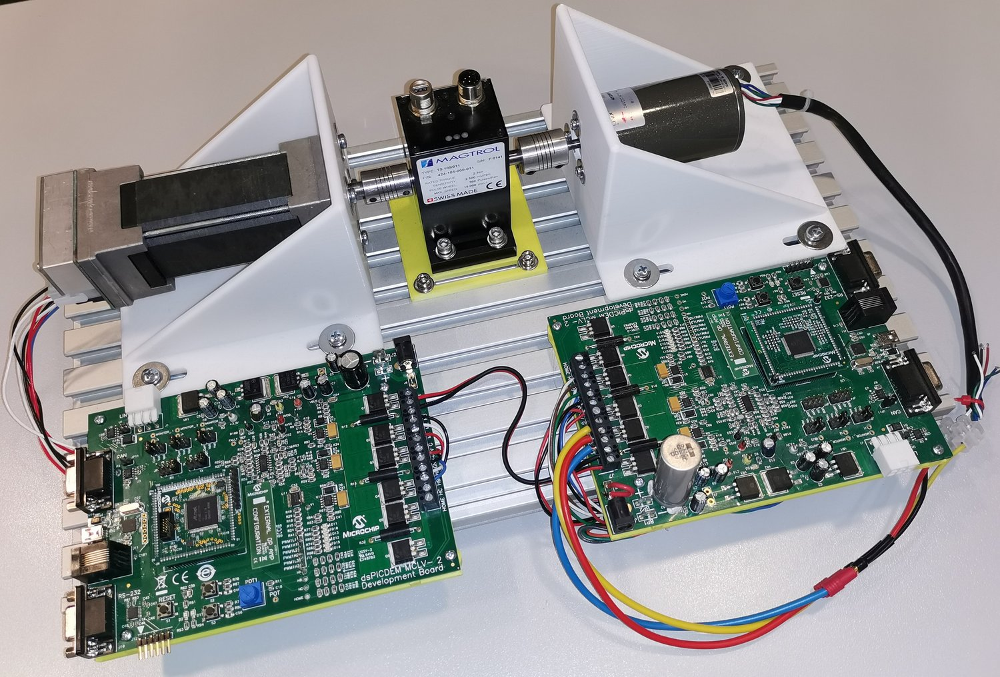
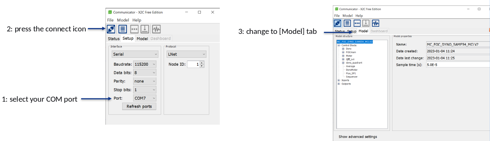
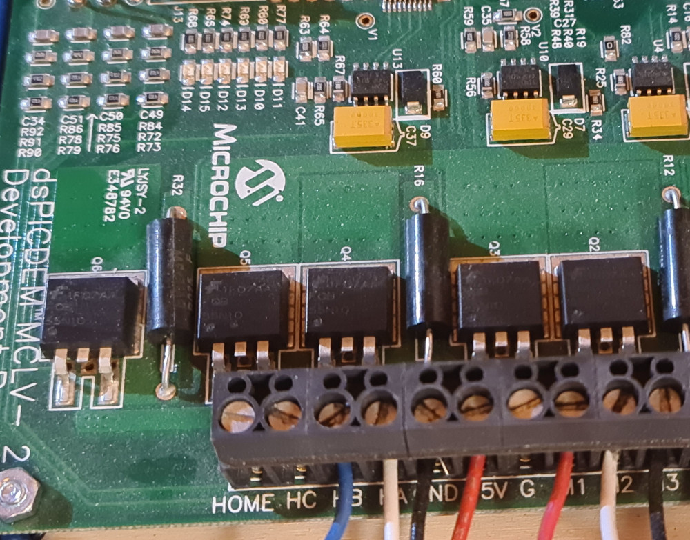

# MPLAB X Project: MC_FOC_DYNO_SAME54_MCLV2

This is a dynamometer control demo project for [MCLV2 board](https://www.microchip.com/developmenttools/ProductDetails/dm330021-2) development board and [SAME54](https://www.microchip.com/DevelopmentTools/ProductDetails/PartNO/MA320207) microcontroller.

Apply dynamic load to test motor control development.

### Features
* Running standalone without scilab (No SCILAB, X2C and XC32 compiler required)
* Run-time [monitoring](#monitoring-signals) (virtual scope)
* Change load profiles in run-time
  * Constant load from potentiometer
  * Constant load from variable
  * Trapezoidal load (variables: frequency, raising/falling ramp, high/low value)
  * Fan load (k*n²[rpm], variable:k 
  * Sine load ( variable: frequency, amplitude, offset)
  * Angle dependent loads ( electrical/mechanical)
    * 3 different table dependent load profiles (variables: amplitude and offset)
      * Unbalanced load (constant + sine)
      * Broken bearing (constant + rectangle)
      * Triangle ( constant + triangle)
    * Various compressor load profiles possible

## Getting Started

The demo is ready to use with the [listed hardwares below](#hardware).

1. Clone or Download project to mc_foc_sl_fip_dspic33ck_lvmc.x folder. (Keep the folder name)
2. [Connect Hardware](#connectors-used)
3. Move to [..\mc_foc_dyno_same54_mclv2\doc\standalone]
4. Program [MC_FOC_DYNO_SAME54_MCLV2.X.production.hex] onto your SAME54 PIM
5. Disconnect the programmer and reset the MCLV-2 board
6. Execute start.bat 
   

## HW setup

* MCLV-2
* ATSAME54
* Hurst300 motor with encoder
* RS232 cable
* Software setup
* Microchip programmer (SW and HW)
* MCLV-2 Settings
  * JP1,2,3 -> Curr
  * JP4,5 -> UART
  * M1 – red
  * M2 – white
  * M3 – black
  * HA – QEI white
  * HB – QEI blue

