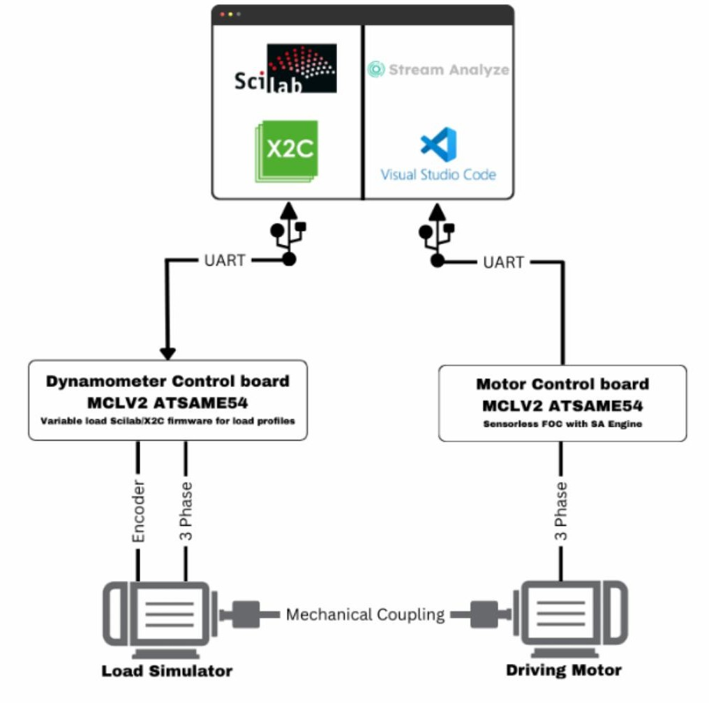

# MCHP-Dyno – Motor Control Dynamometer  
Last updated: December 2025

MCHP-Dyno is a compact, X2C-enabled motor dynamometer designed for load testing, algorithm validation, sensorless control development, and AI/ML data capture.  
This repository documents the setup, firmware workflow, load profiles, and usage instructions for running the miniDyno 2.0 on Microchip motor-control platforms.

The system supports both standalone operation (HEX-only, no toolchain required) and full SCILAB/X2C model-based workflows. It is compatible with MCLV-2 hardware and ATSAME54 PIMs.

---

<p align="center">
  
</p>

## What MCHP-Dyno Is

A ready-to-use motor dyno environment supporting:

- 4Q operation (CW/CCW, motor/generator/brake)
- Programmable load profiles (constant, trapezoid, sine, fan, angle-dependent, table-driven)
- Motor torque/speed profiles for DUT evaluation
- AI/ML dataset creation (anomalies, noise patterns, dynamic behaviours)
- Real-time monitoring via X2C Scope
- Standalone operation without Scilab/X2C if desired

The goal is to allow firmware engineers to test motor algorithms quickly—without building a custom mechanical setup.

---

## Key Features

### DYNO Mode
- Constant load (potentiometer or numeric)  
- Trapezoidal load (frequency, high/low values, ramp rates)  
- Fan load (k · n²)  
- Sine load (frequency, amplitude, offset)  
- Angle-dependent loads (electrical / mechanical)  
- Table-driven load profiles:
  - Unbalanced load (constant + sine)
  - Broken bearing (constant + rectangle)
  - Triangle (constant + triangle)
- Compressor-like load profiles (supported via table definition)

### Motor Mode
- Constant torque  
- Constant speed  
- Potentiometer or variable setpoints  
- Trapezoidal speed profiles  

### Hardware Highlights
- MCLV-2 motor control board  
- ATSAME54 PIM  
- Hurst 300 motor with encoder  
- RS232 connection (X2C Scope compatible)
- Optional Magtrol TS105/011 torque sensor  
- 3D-printable universal bracket (OpenSCAD)

---

## Repository Layout

```
miniDyno-2.0/
├── README.md <-- you are here
├── doc/
│ ├── standalone/ <-- HEX + startup scripts for standalone mode
│ ├── 3Dparts/ <-- OpenSCAD + STL universal motor bracket
│ └── ...
├── firmware/ <-- SAME54 dyno firmware (reference)
└── ...
```


---

## Requirements

### Hardware
- MCLV-2 development board  
- ATSAME54 PIM  
- Hurst 300 motor (with QEI encoder)  
- RS232 cable (DYNO ↔ Motor board)  
- Optional: Magtrol torque sensor  

### Jumpers
- JP1, JP2, JP3 → Current sense  
- JP4, JP5 → UART  
- Motor phases:
  - M1 = red
  - M2 = white
  - M3 = black
- Encoder:
  - HA = QEI white
  - HB = QEI blue

**Important:**  
Ensure the DYNO board power is physically connected to the motor board.  
Generator mode requires a valid power path to dissipate energy.

---

## Standalone Usage (No Scilab / No X2C)

### What you need
- Microchip programmer (ICD4, PICkit4, SNAP)
- MPLAB X or IPE

### Steps
1. Navigate to `doc/standalone` in the Bitbucket project.
2. Program the file:  
   **MC_FOC_DYNO_SAME54_MCLV2.X.production.hex**
3. Disconnect programmer and reset the MCLV-2.
4. Run **start.bat**.
5. In the GUI:
   - Select your COM port  
   - Press **Connect**  
   - Switch to the **Model** tab  

You're now running MCHP-Dyno in standalone mode.

---

## Using miniDyno with SCILAB + X2C

### Requirements
- Scilab 6.1.1  
- X2C 6.4  
- MPLAB X (Harmony 3 + XC32 free compiler)  
- Microchip programmer  

This mode allows you to modify model parameters, load tables, and control algorithms using X2C’s model-based workflow.

---

## DYNO Torque Profiles

### torque_mode
0 = Constant (potentiometer)
1 = Constant (const_torque)
2 = Trapezoid (freq, high, low, Tr, Tf)
3 = Fan load (fan_gain)
4 = Sine (A, f, fmax, Offset)
5 = Unbalanced (GainT5, ConstT5)
6 = Broken bearing (GainT6, ConstT6)
7 = Triangle (GainT7, ConstT7)

---

## Motor Mode Parameters

### speed_mode
0 = Constant speed (potentiometer)
1 = Constant speed (const_speed)
2 = Trapezoidal speed profile


Additional controls:
motor_torquemode
1 = speed control
0 = torque control

DynoMotor
1 = Dyno mode
0 = Motor mode


---

## X2C Scope

1. Start X2C Scope  
2. Select COM port  
3. Set Sample Time Factor  
4. Press **Sample**  

Signals stream in real time for debugging load/torque profiles, speed control, angle behaviour, and anomalies.

---

## 3D Printable Bracket

OpenSCAD design for unified motor mounting:  
Location: `doc/3Dparts`

Printing recommendations:
- PLA  
- 0.2 mm layers  
- 60% infill  
- Adjustable motor spacing  

---

## Future Enhancements

- Position control for ZSMT tuning  
- Standalone GUI  
- Torque sensor calibration  
- Real torque control mode  
- Power measurement (in/out)  
- MCHV-2/3 support  
- MCLV-48V-300W port  

---

## License & Copyright

© 2025 Microchip Technology Inc. and its subsidiaries  
All rights reserved.

---
