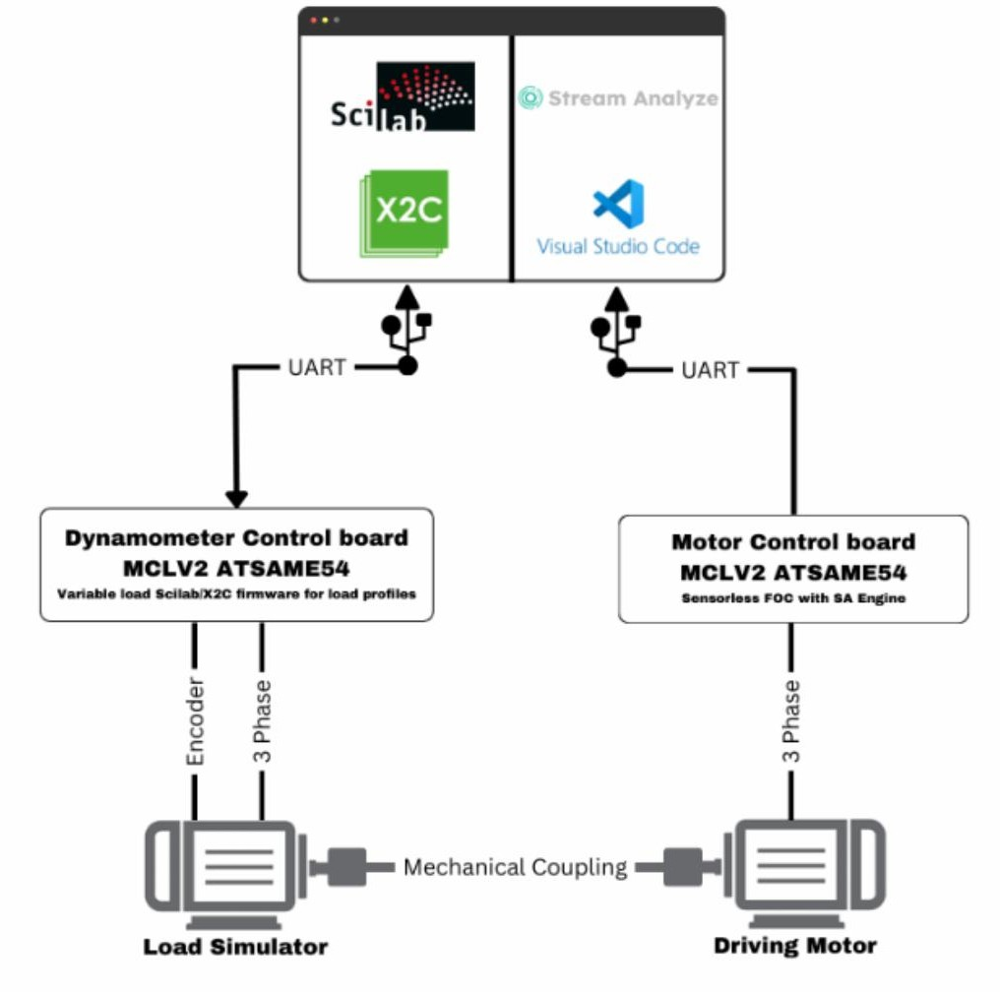

# MCHP-Dyno: Motor Control Dynamometer  
Last updated: December 2025

MCHP-Dyno is a compact, X2C-enabled motor dynamometer designed for load testing, algorithm validation, sensorless control development, and AI/ML data capture.  
This repository documents the setup, firmware workflow, load profiles, and usage instructions for running the MCHP-Dyno on Microchip motor-control platforms.

Documentation website (HTML build): [https://impressivetaste.github.io/Dyno-MCHP-Repository-WIP/](https://impressivetaste.github.io/Dyno-MCHP-Repository-WIP/)

The system supports both standalone operation (HEX-only, no toolchain required) and full SCILAB/X2C model-based workflows.  
It is compatible with the following hardware platforms:

- [MCLV-2](https://www.microchip.com/en-us/development-tool/dm330021-2)  
- [MCLV-48V-300W](https://www.microchip.com/en-us/development-tool/ev18h47a)  
- [MCHV-3](https://www.microchip.com/en-us/development-tool/dm330023-3)  
- [MCHV-230V-1.5kW](https://www.microchip.com/en-us/development-tool/ev78u65a)
---

<p align="center">
  
</p>

## What MCHP-Dyno Is

A ready-to-use motor dyno environment supporting:

- 4Q operation (CW/CCW, motor/generator/brake)
- Programmable load profiles (constant, trapezoid, sine, fan, angle-dependent, table-driven)
- Motor torque/speed profiles for DUT evaluation
- AI/ML dataset creation (anomalies, noise patterns, dynamic behaviours)
- Real-time monitoring via X2C Scope
- Standalone operation without Scilab/X2C if desired

The goal is to allow anyone to test motor algorithms quickly, without building or buying a custom, often expensive, setup.


## Key Features

### DYNO Mode
- Constant load (potentiometer or numeric)  
- Trapezoidal load (frequency, high/low values, ramp rates)  
- Fan load (k · n²)  
- Sine load (frequency, amplitude, offset)  
- Angle-dependent loads (electrical / mechanical)  
- Table-driven load profiles:
  - Unbalanced load (constant + sine)
  - Broken bearing (constant + rectangle)
  - Triangle (constant + triangle)
- Compressor-like load profiles (supported via table definition)

### Motor Mode
- Constant torque  
- Constant speed  
- Potentiometer or variable setpoints  
- Trapezoidal speed profiles  

### Hardware Highlights
- MCLV-2 motor control board  
- ATSAME54 PIM  
- Hurst 300 motor with encoder  
- RS232 connection (X2C Scope compatible)
- Optional Magtrol TS105/011 torque sensor  
- 3D-printable universal bracket (OpenSCAD)

## Repository Layout

```
miniDyno-2.0/
├── README.md <-- you are here
├── 3Dparts/ <-- OpenSCAD + STL universal motor bracket
├── MCHPDyno/
│ ├── mc_foc_dyno_same54_mclv2/
│ │ └── doc/ <-- project docs + standalone assets
│ └── ...
├── docs/ <-- rendered docs + static assets
└── ...
```

## Project Naming Conventions

Project names use underscore-separated "placeholder" in a fixed order:
`<topic>_<algorithm>_<S/SL>_<datatype>_<device>_<feature>_<demo-board>_<customer>`

The projects only keeps the "placeholders" that apply.

"placeholder" options (from the motor control naming list):
- topic (project area): MC, BLINKY, PWR, SENS
- algorithm (control/app type): FOC, BLOCK, MB, H3, QSPIN, LEG
- S/SL (variant tag): S, SL, SSL, DYNO, ZSMT, ZSMTLF
- datatype (numeric format): FIP, FLOAT, DOUBLE, FIP32
- device (target MCU): dsPIC33CK, dSPIC33EP, dSPIC33A, SAME54, SAME70, dsPIC33CKMC, dsPIC33CD, SAMC21, SAMD21
- feature (optional flag): PLL, SMO, PFC
- demo board (target board): MCLV2, MCHV2, MCHV3, MCLV48V300W, MCHV230VAC1.5KW, LVMC
- customer (optional tag): SA

"Placeholder" meanings and links:
- topic: MC = Motor Control; BLINKY = easy blinky example; PWR = Digital Power; SENS = sensing demonstration.
- algorithm: FOC = Field Oriented Control; BLOCK = Block commutation (six-step commutation); MB = motorBench-generated code; H3 = MPLAB Harmony 3 generated code; QSPIN = MPLAB Harmony QuickSpin generated code; LEG = Legacy (hand-authored) code.
- S/SL: S = sensored; SL = sensorless; SSL = sensorless single-shunt; DYNO = dynamometer (dyno) project; ZSMT = Zero-Speed/Maximum-Torque (ZS/MT) algorithm ([Microchip ZSMT overview](https://www.microchip.com/en-us/tools-resources/configure/mplab-harmony/quickspin/zsmt-algorithm)); ZSMTLF = ZS/MT low-frequency variant.
- datatype: FIP = fixed-point (usually 16-bit); FIP32 = 32-bit fixed-point; FLOAT = floating-point; DOUBLE = double-precision floating-point.
- feature: PLL = Phase-Locked Loop ([AN1292](https://ww1.microchip.com/downloads/en/AppNotes/01292A.pdf)); SMO = Sliding Mode Observer ([AN4398](https://ww1.microchip.com/downloads/aemDocuments/documents/MCU32/ApplicationNotes/ApplicationNotes/Sensorless-Field-Oriented-Control-for-a-Permanent-Magnet-Synchronous-Motor-Using-Sliding-Mode-DS00004398.pdf)); PFC = Power Factor Correction([AN1208](https://ww1.microchip.com/downloads/en/appnotes/01208a.pdf)).
- demo board: [MCLV2](https://www.microchip.com/en-us/development-tool/dm330021-2), [MCHV2](https://www.microchip.com/en-us/tools-resources/reference-designs/aircon-board), [MCHV3](https://www.microchip.com/en-us/development-tool/dm330023-3), [MCLV48V300W](https://www.microchip.com/en-us/development-tool/ev18h47a), [MCHV230VAC1.5KW](https://www.microchip.com/en-us/development-tool/ev78u65a), [LVMC](https://www.microchip.com/en-us/solutions/technologies/motor-control-and-drive/hardware-development-tools).
- Partner: SA = Stream Analyze (AI/data collection)([Documentation](https://studio.streamanalyze.com/docs/guides/general-guides/intro)).

Examples:
- `mc_foc_dyno_same54_mclv2` (MC + FOC + DYNO + SAME54 + MCLV2)
- `mc_mb_sl_fip_dsPIC33CK_mclv48v300w.X` (MC + MB + SL + FIP + dsPIC33CK + MCLV48V300W)
- `MC_FOC_DYNO_SAME54_MCLV2.X.production.hex` (same fields, exported artifact)


## Requirements

### Hardware
- MCLV-2 development board  
- ATSAME54 PIM  
- Hurst 300 motor (with QEI encoder)  
- RS232 cable (DYNO ↔ Motor board)  
- Optional: Magtrol torque sensor  

### Jumpers
- JP1, JP2, JP3 → Current sense  
- JP4, JP5 → UART  
- Motor phases:
  - M1 = red
  - M2 = white
  - M3 = black
- Encoder:
  - HA = QEI white
  - HB = QEI blue

**Important:**  
Ensure the DYNO board power is physically connected to the motor board.  
Generator mode requires a valid power path to dissipate energy.


## Standalone Usage (No Scilab / No X2C)

### What you need
- Microchip programmer (ICD4, PICkit4, SNAP)
- MPLAB X or IPE

### Steps
1. Navigate to `doc/standalone` in the Bitbucket project.
2. Program the file:  
   **MC_FOC_DYNO_SAME54_MCLV2.X.production.hex**
3. Disconnect programmer and reset the MCLV-2.
4. Run **start.bat**.
5. In the GUI:
   - Select your COM port  
   - Press **Connect**  
   - Switch to the **Model** tab  

You're now running MCHP-Dyno in standalone mode.

Optional IGaT display (EV14C17A): program the display HEX separately from
`MCHPDyno/igat_ev14c17a/doc/standalone/`.

Motor-side DIM firmware (MCLV-48V-300W): program one of the DIM HEX files from
`motor_ACT57BLF02/mclv48v300w_dim_hex/doc/standalone/` to showcase different
algorithms (Single-Shunt, ZS/MT, or X2C-enabled).


## Using miniDyno with SCILAB + X2C

### Requirements
- Scilab 6.1.1  
- X2C 6.4  
- MPLAB X (Harmony 3 + XC32 free compiler)  
- Microchip programmer  

This mode allows you to modify model parameters, load tables, and control algorithms using X2C’s model-based workflow.


## DYNO Torque Profiles

### torque_mode
0 = Constant (potentiometer)
1 = Constant (const_torque)
2 = Trapezoid (freq, high, low, Tr, Tf)
3 = Fan load (fan_gain)
4 = Sine (A, f, fmax, Offset)
5 = Unbalanced (GainT5, ConstT5)
6 = Broken bearing (GainT6, ConstT6)
7 = Triangle (GainT7, ConstT7)


## Motor Mode Parameters

### speed_mode
0 = Constant speed (potentiometer)
1 = Constant speed (const_speed)
2 = Trapezoidal speed profile


Additional controls:
motor_torquemode
1 = speed control
0 = torque control

DynoMotor
1 = Dyno mode
0 = Motor mode


## X2C Scope

1. Start X2C Scope  
2. Select COM port  
3. Set Sample Time Factor  
4. Press **Sample**  

Signals stream in real time for debugging load/torque profiles, speed control, angle behaviour, and anomalies.

## 3D Printable Bracket

OpenSCAD design for unified motor mounting:  
Location: `3Dparts`

Printing recommendations:
- PLA  
- 0.2 mm layers  
- 60% infill  
- Adjustable motor spacing  


## Future Enhancements

- Position control for ZSMT tuning  
- Standalone GUI  
- Torque sensor calibration  
- Real torque control mode  
- Power measurement (in/out)  
- MCHV-2/3 support  
- MCLV-48V-300W port  


## Want to contribute?
This project is open source and contributions are welcome. 
If you are new to GitHub, Github pages, and so on... don't worry, here is a small video that tries to explain how to get a setup for contributions ready: https://youtu.be/irQH9ktzQAw

----------------------------------------------------------------------
REFERENCE & DISCLAIMER
----------------------------------------------------------------------

This project, including all hardware designs, documentation, images, and configuration examples, is provided for reference and evaluation purposes only.

It is supplied “AS IS”, without any express, implied, or statutory warranties, including but not limited to warranties of merchantability, fitness for a particular purpose, or non-infringement. The information is intended to assist with experimentation, learning, and prototyping and does not constitute a certified or production-ready design.

The author assumes no responsibility or liability for any errors, omissions, hardware damage, data loss, personal injury, or other consequences arising from the use, reproduction, modification, or deployment of this material. Users are solely responsible for verifying correctness, safety, electrical compliance, and suitability for their specific application
