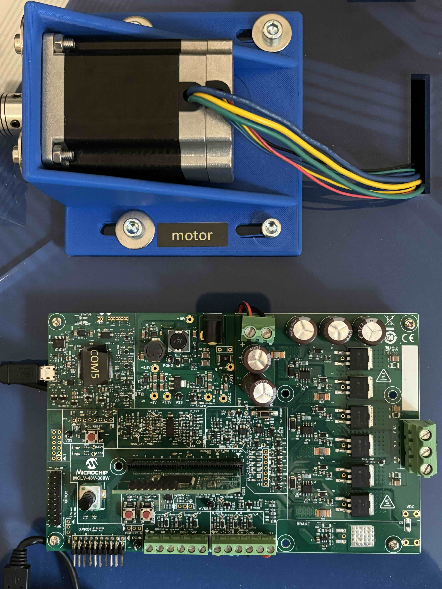

Motor Side (Device Under Test)
==============================

This page covers the motor-side (DUT) hardware, assembly, and control firmware.
For the dynamometer side, see :doc:`Make Your MC-Dyno <make_your_MC_Dyno>`.

.. contents::
   :local:
   :depth: 2

1. Hardware
-----------

.. admonition:: For a smooth MC-Dyno build...

   If you want the most up-to-date DUT-side hardware that is currently used in the majority
   of the MC-Dyno projects is:

   - One `MCLV-48V-300W Development Board <https://www.microchip.com/en-us/development-tool/ev18h47a>`_ for the Device-Under-Test side
   - One `ACT57BLF02 Motor <https://www.act-motor.com/brushless-dc-motor-57blf-product/>`_ for the Device-Under-Test side

**Required hardware (DUT side)**

- One `MCLV-48V-300W Development Board <https://www.microchip.com/en-us/development-tool/ev18h47a>`_ for the DUT side.
- One `ACT57BLF02 Motor <https://www.act-motor.com/brushless-dc-motor-57blf-product/>`_ for the DUT side.
- One `3A 24V Power Supply <https://www.microchipdirect.com/dev-tools/AC002013>`_ (shared with the dyno side).
- Flexible aluminum jaw shaft coupling (if the above suggested motors are used, then 8mm bore should be selected).
- Eight M4 x 10 mm hex-socket screws
- 3D printed brackets, which can be found in the `3Dparts <https://github.com/ImpressiveTaste/Dyno-MCHP-Repository-WIP/tree/main/3Dparts>`_ folder (OpenSCAD + STL).
- Wood mounting base or 4 (20x20) T-slot aluminum profiles, minimum length 500 mm
- For T-slot mounting Eight M5 socket-head cap screws (M5 SHCS) - 16 mm
- For T-slot mounting Eight M5 T-slot nuts
- Windows PC running Windows 10.

**Alternative Hardware (DUT side)**

- For High Voltage Motor Testing - One `MCHV-230V-1.5kW Development Board <https://www.microchip.com/en-us/development-tool/ev78u65a>`_ for the DUT side.
- An alternative motor that can be used for the DUT side is the `AC300022 - 24V 3-PHASE BRUSHLESS DC MOTOR WITH ENCODER <https://www.microchip.com/en-us/development-tool/ac300022>`_.

2. Assembling the hardware
--------------------------

In this section the steps to build the MC-Dyno motor side (DUT) will be described.

Before starting this guide, navigate to the file section `3Dparts <https://github.com/ImpressiveTaste/Dyno-MCHP-Repository-WIP/tree/main/3Dparts>`_
and **3D print the motor mounts** for the DUT motor used. For the DUT side, use
`ACT57BLF_blue_wedge_V1_00.stl <https://github.com/ImpressiveTaste/Dyno-MCHP-Repository-WIP/blob/main/3Dparts/STL/ACT57BLF_blue_wedge_V1_00.stl>`_.
Print one bracket for the DUT motor.
There are two bracket sizes available: small for portable demonstrators (blue wedge) and standard
size (unified). Before printing, decide the motor brackets versions that matches best your setup.
You can also find the **openSCAD files for the brackets**
in there, so if you would like to **modify** this model to fit a **different motor**, you're welcome to do so.

.. figure:: _static/images/ACT57BLF02-Sliced-Bambu.png
   :alt: ACT57BLF02 bracket slicing preview
   :align: center
   :width: 80%

   ACT57BLF02 bracket -- slicing preview (PLA, 100% infill).

2.1 Step 1: Mount DUT Motor to 3D printed braket, align and fix
~~~~~~~~~~~~~~~~~~~~~~~~~~~~~~~~~~~~~~~~~~~~~~~~~~~~~~~~~~~~~~~

As a first step, mount the DUT motor in the **mounting bracket** that you have 3D printed.

After that, fix the motor bracket to the T-Slot or your base support.

If you are using different motors be sure to make the brackets in such a way that the motor
shafts are aligned. This is very important. Align the DUT motor shaft with the dyno motor shaft
using the shaft coupler to help you align them.

Fix everything by tightening the different screws. If the shaft coupler spins freely, then the "hand alignment process" was
correct, if you see wiggle or that the shaft requires different forces in different positions to rotate, that might mean that
the motor shafts are not completely aligned. If that happens please untighten, move the brackets as needed and tighten
the screws needed to guarantee the best alignment possible.

   DUT Standard Configuration

.. tip::

   The shaft coupler can handle some small misalignment but will add unnecessary force to the Motor
   shafts, making the control not reliable, for this reason try to ensure shaft alignment between motors.

2.2 Setup Boards and wire them to the motor
~~~~~~~~~~~~~~~~~~~~~~~~~~~~~~~~~~~~~~~~~~~

**2.2.1 Wiring the Device-Under-Test side**

For Wiring the ACT motor to the MCLV-48V-300W board follow the image below as reference.

For phase A connect the yelow wire, for phase B connect the green wire and for phase C connect the BLU wire

.. list-table::
   :widths: 50 50
   :align: center

   * - .. figure:: _static/images/MCLV-Encoder-Wiring.png
          :alt: HurstMotorWiring
          :width: 95%

          Enocder ACT Motor Wiring to MCLV-48V-300W
     - .. figure:: _static/images/ConnectionDiagrams.png
          :alt: Connection Diagrams
          :width: 95%

          Connection Diagrams

**2.2.2 Configure MCLV-48V-300W (DUT)**

For the MCLV-48V-300W you should follow the conenction shown below.

Note that this board hosts the DIM for motor-control algorithms. The motor-side HEX downloads are listed below.

.. tip::

   The `MCLV48_300_DIMhold.stl <https://github.com/ImpressiveTaste/Dyno-MCHP-Repository-WIP/blob/main/3Dparts/STL/MCLV48_300_DIMhold.stl>`_ is not necessary,
   but to guarantee better connection of the **DIM** boards to the MCLV-48V-300W board the suggestion is to 3D print one and use it.

.. figure:: _static/images/MCLV-48V-wiring.png
   :alt: MCLV-48V-300W board configuration
   :align: center
   :width: 70%

   MCLV-48V-300W board configuration

The DUT board shares the DC-link with the dyno board. Follow the warning and wiring notes on
:doc:`Make Your MC-Dyno <make_your_MC_Dyno>`.

3. Monitor motor behavior with pyX2Cscope
-----------------------------------------

To view motor behavior on the DUT side, you can use `pyX2Cscope <https://x2cscope.github.io/pyx2cscope/>`_ through Python.
There are also standalone apps you can download and run directly without installing anything beyond the app itself.
To download the Standalone App this is the up-to-date link: `pyX2Cscope releases <https://github.com/X2Cscope/pyx2cscope/releases>`_.

.. tip::

   To actually being able to monitor the board, you will need to load to pyX2Cscope the *.elf* file related to the project that is loaded to the board.
   You can find the *.elf* files in the *production* *dist* folder for the project currently loaded on the board.
   All motor control examples by Microchip are already compatible with X2Cscope, so the only thing you need to do is program the board, and load the *.elf* file.
   
   Here is a good video showing how to use *X2Cscope* with some code: `Video Tutorial Example using motorBench® Development Suite <https://youtu.be/Znv0quaTxXc?si=lDy2cfnZS-tfgaD6>`_.

.. list-table::
   :widths: 50 50
   :align: center

   * - .. figure:: _static/images/pyX2CscopeStandalone-WebInterface.png
          :alt: pyX2Cscope Standalone Web Interface
          :width: 95%

          pyX2Cscope Standalone Web Interface
     - .. figure:: _static/images/pyX2Cscope-Standalone-App.png
          :alt: pyX2Cscope Standalone App
          :width: 95%

          pyX2Cscope Standalone App
   * - .. figure:: _static/images/DownloadingAndUsingpyX2CscopeStandalone.png
          :alt: Downloading and using pyX2Cscope Standalone
          :width: 95%

          Downloading and using pyX2Cscope Standalone
     - .. figure:: _static/images/DownloadingAndUsingpyX2CscopeStandalone2.png
          :alt: Downloading and using pyX2Cscope Standalone (2)
          :width: 95%

          Downloading and using pyX2Cscope Standalone (2)

These HEX files target the motor-side control DIM installed on the
MCLV-48V-300W Development Board (EV18H47A). They are used to showcase different
motor-control algorithms on the dyno.

Example DIM: dsPIC33CK256MP508 Motor Control DIM (EV62P66A)
https://www.microchip.com/en-us/development-tool/ev62p66a

HEX Location
------------

``motor_ACT57BLF02/mclv48v300w_dim_hex/doc/standalone/``

Downloads
---------

.. container:: motor-dim-downloads

   :download:`Single-shunt (dsPIC33AK128MC106 DIM) <_downloads/dsPIC33AK128MC106_MC_Dyno_08_01_2026_SingleShunt_DIM.hex>`

   :download:`ZS/MT (dsPIC33CK256MP508 DIM) <_downloads/dsPIC33CK256MP508_MC_Dyno_08_01_2026_ZSMT_DIM.hex>`

   :download:`X2C (dsPIC33CK256MP508 DIM) <_downloads/dsPIC33CK256MP508_MC_Dyno_08_01_2026_X2C_DIM.hex>`

   :download:`QuickSpin (ATSAME54P20A DIM) <_downloads/ATSAME54P20A_MC_Dyno_08_01_2026_QuickSpin_DIM.hex>`

   :download:`StreamAnalyze (ATSAME54P20A DIM) <_downloads/ATSAME54P20A_MC_Dyno_08_01_2026_StreamAnalyze_DIM.hex>`

Algorithm Notes
---------------

DIM mapping:

- Single-shunt demo runs on the dsPIC33AK128MC106 DIM.
- ZS/MT and X2C demos run on the dsPIC33CK256MP508 DIM.

Single-shunt current measurement (MCAF R8):

- Samples the DC-link current twice in a single PWM period and reconstructs
  phase currents based on the inverter switching state.
- Requires a dedicated, high-priority ADC ISR and a minimum switching-state
  window (t_sample + dead time).
- For estimators other than ZS/MT, use single update in Dual Edge Center
  Aligned PWM mode.

Zero-Speed / Maximum Torque (ZS/MT) Estimator

ZS/MT is a sensorless position and speed estimation algorithm specifically
designed to operate where back-EMF based estimators fail, at zero and ultra-low
speeds.

Operating Principle - High-Frequency Signal Injection

Unlike PLL-type estimators, ZS/MT is intrusive: it injects a high-frequency
excitation voltage into the stator and measures the motor's response. This
leverages motor saliency to determine rotor angle even at standstill.

Motor Requirements (Saliency)

ZS/MT requires a motor with significant Ld != Lq saliency. It is thus primarily
intended for IPMSM machines, where q-axis inductance is notably higher than
d-axis inductance.

Startup Sequence - IPC for Zero-Speed Torque Production

To deliver torque from standstill, ZS/MT uses a startup procedure termed
"ZS/MT + Initial Position Correction (IPC)", allowing the controller to
correctly align the stator field before any mechanical motion begins.

Hybrid Operation - Low-Speed to High-Speed Transition

Because the injected signal consumes voltage headroom, ZS/MT cannot achieve the
absolute maximum speed by itself. In practice, it is combined with a back-EMF
estimator (for example, PLL) using a hybrid scheme (for example, "Minotaur
hard-switch") to allow:

- ZS/MT for 0-to-low-speed operation
- PLL for mid-to-high-speed operation

Tuning and Configuration Parameters

Reference hardware:
https://www.microchip.com/en-us/development-tool/ev18h47a
