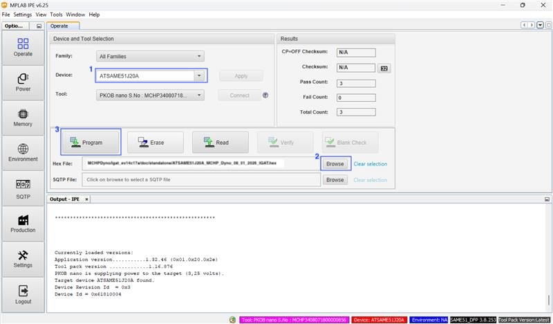

IGaT Display (EV14C17A)
=======================

The Integrated Graphics and Touch (IGaT) Curiosity Evaluation Kit (EV14C17A)
is used as an optional standalone display alongside the Dyno. It runs on a
SAM E51 MCU and is programmed independently from the dyno controller.

Here is a small video showing the capabilities of the board: https://youtu.be/NBVHWmz8veU

Firmware Location
-----------------

The display HEX lives in:

``MCHPDyno/igat_ev14c17a/doc/standalone/ATSAME51J20A_MCHP_Dyno_08_01_2026_IGAT.hex``

Download
--------

:download:`Download IGaT HEX <_downloads/ATSAME51J20A_MCHP_Dyno_08_01_2026_IGAT.hex>`

Programming Steps
-----------------

1. Connect a microUSB cable to the EV14C17A debug port.
2. Open MPLAB IPE and select the ATSAME51PJ20A device.
3. Program the HEX from ``doc/standalone/``.
4. Reset the board to run the UI.

Final Result
------------

.. image:: _static/igat_final_result.png
   :alt: IGaT display final result

More info on the kit:
https://www.microchip.com/en-us/development-tool/ev14c17a
