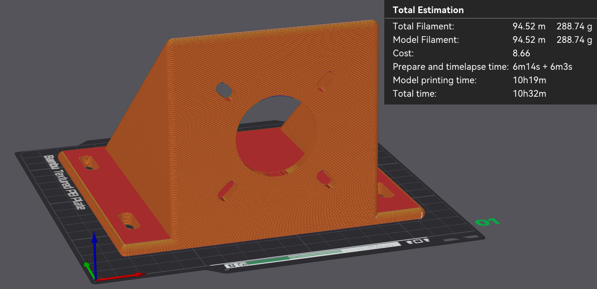

Make Your MCHP-Dyno
===================

.. contents::
   :local:
   :depth: 2

1. Introduction
---------------

This page intent is to guide you on the creation of your first MCHP-Dyno project.
The MCHP-Dyno proposed here, is the cheapest and easiest assembly that can be done
to get a working MCHP-Dyno setup.
You can use this page as a guide even if you have a different motor, a different
controller board and/or different motor holders. 

.. tip::

   In some instances you will find **tip** blocks like these... in here you
   will find tips and tricks on how to improve or "hack" the MCHP-Dyno for your
   specific needs.

.. warning::

   Warning blocks are not decoration. If you ignore them, your MCHP-Dyno may
   respond with mysterious smoke. Read carefully—future-you will thank present-you.
   This warning has already saved several MCHP-Dyno projects...
   
All of the files and links that are required during the built are available here. 
These are mainly 3D models and source code.

Once you start following the different chapters, open the corresponding files and
links to have all of the required files handy.

The content might be updated over time. Legacy code will still be available in the **legacy** folder 
where the legacy files will be organized by date when they where out-commissioned.

1.1 Hardware
~~~~~~~~~~~~

.. admonition:: For a smooth MCHP-Dyno build...

   If you want the most up-to-date hardware, that is currently used in the majority of the **MCHP-Dyno projects** is: 

   - One `MCLV-48V-300W Development Board <https://www.microchip.com/en-us/development-tool/ev18h47a>`_ for the Device-Under-Test side
   - One `ACT57BLF02 Motor <https://www.act-motor.com/brushless-dc-motor-57blf-product/>`_ for the Device-Under-Test side
   - One `MCLV-2 Development Board <https://www.microchip.com/en-us/development-tool/dm330021-2>`_ for the Dynamometer side
   - One `AC300022 - 24V 3-PHASE BRUSHLESS DC MOTOR WITH ENCODER <https://www.microchip.com/en-us/development-tool/ac300022>`_ for the Dynamometer side
   - If you use the `MCLV-2 Development Board <https://www.microchip.com/en-us/development-tool/dm330021-2>`_, for communicating with the pc, reading data and controlling the dynamometer, an USB to RS232 board is suggested, this is the one used in the amjority of the MCHP-Dyno Projects: `MCP2200 USB TO RS232 DEMO BOARD <https://www.microchip.com/en-us/development-tool/mcp2200ev-vcp>`_

**Required hardware**

- Two `MCLV-48V-300W Development Board <https://www.microchip.com/en-us/development-tool/ev18h47a>`_ if you also want to create the driver for the Device-Under-Test side (motor).
- One `MCLV-48V-300W Development Board <https://www.microchip.com/en-us/development-tool/ev18h47a>`_ if you only need the dynamometer side. 
- For the Dynamometer side you will need a motor with encoder. The standard one used is the: `AC300022 - 24V 3-PHASE BRUSHLESS DC MOTOR WITH ENCODER <https://www.microchip.com/en-us/development-tool/ac300022>`_. 
- For the Device-Under-Test (motor driver) code demonstrations, in this repository, the majority was made for the `ACT57BLF02 Motor <https://www.act-motor.com/brushless-dc-motor-57blf-product/>`_ and some for the `AC300022 - 24V 3-PHASE BRUSHLESS DC MOTOR WITH ENCODER <https://www.microchip.com/en-us/development-tool/ac300022>`_.
- One `3A 24V Power Supply <https://www.microchipdirect.com/dev-tools/AC002013>`_
- Flexible aluminum jaw shaft coupling (if the above suggested motors are used, then 8mm bore should be selected).
- Eight M4 × 10 mm hex-socket screws
- 3D printed brackets, which can be found in the `3Dparts <https://github.com/ImpressiveTaste/Dyno-MCHP-Repository-WIP/tree/main/3Dparts>`_ folder (OpenSCAD + STL).
- Wood mounting base or 4 (20×20) T-slot aluminum profiles, minimum length 500 mm
- For T-slot mounting Eight M5 socket-head cap screws (M5 SHCS) - 16 mm
- For T-slot mounting Eight M5 T-slot nuts
- Windows PC running Windows 10.

**Alternative Hardware** 

- For High Voltage Motor Testing - Two `MCHV-230V-1.5kW Development Board <https://www.microchip.com/en-us/development-tool/ev78u65a>`_ if you also want to create the driver for the Device-Under-Test side (motor).
- For High Voltage Motor Testing - One `MCHV-230V-1.5kW Development Board <https://www.microchip.com/en-us/development-tool/ev78u65a>`_ if you only need the dynamometer side. 
- `MCLV-2 Development Board <https://www.microchip.com/en-us/development-tool/dm330021-2>`_ can be used instead of the MCLV-48V-300W for the dynamomter side, performance is very similar. 
- An alternative motor that can be used for the Dynamometer side is the `ACT57BLF02 Motor <https://www.act-motor.com/brushless-dc-motor-57blf-product/>`_, this motor is also the one most used for the Device-Under-Test side (motor) demonstrations.

1.2 Software needed
~~~~~~~~~~~~~~~~~~~

- Scilab 6.1.1 (installation directory: https://www.scilab.org/download/previous-versions); newer versions will not work  
- X2C 6.4 (Installation tutorial: https://www.youtube.com/watch?v=H_EVY1D95eY)  
- MPLAB X IDE and MPLAB X IPE (installation: https://www.microchip.com/en-us/tools-resources/develop/mplab-x-ide)
- XC-DSC 3.21, which you can install during process of installation of MPLAB X

2. Assembling the hardware
--------------------------

In this section the steps to build a MCHP-Dyno will be described. 
This is the **easiest possible MCHP-Dyno** you can make, but as you saw in the home page, you are free to play around
and make the MCHP-Dyno that best suits your needs.

Before starting this guide, navigate to the file section `3Dparts <https://github.com/ImpressiveTaste/Dyno-MCHP-Repository-WIP/tree/main/3Dparts>`_ 
and **3D print the motor mounts** for the motors used. For the Device‑Under‑Test (DUT) side, use 
`ACT57BLF_blue_wedge_V1_00.stl <https://github.com/ImpressiveTaste/Dyno-MCHP-Repository-WIP/blob/main/3Dparts/STL/ACT57BLF_blue_wedge_V1_00.stl>`_. 
For the dynamometer side, use `Hurst_blue_wedge_V1_00.stl <https://github.com/ImpressiveTaste/Dyno-MCHP-Repository-WIP/blob/main/3Dparts/STL/Hurst_blue_wedge_V1_00.stl>`_. 
Print one bracket per motor (one ACT for the DUT side and one Hurst for the dynamometer side). 
There are two bracket sizes available: small for portable demonstrators (blue wedge) and standard 
size (unified). Before printing, decide the motor brackets versions that matches best your setup.
You can also find the **openSCAD files for the brackets**
in there, so if you would like to **modify** this model to fit a **different motor**, you're welcome to do so. 

.. figure:: _static/images/UnifiedMotorBrackets.png
   :alt: Unified Motor Brackets
   :align: center
   :width: 70%

   Some of the Many Unified Motor Brackets

You can print this model in PLA or PETG and make sure to set the infill to 100%. 
You don't need to enable any supports.

   ACT57BLF02 bracket — slicing preview (PLA, 100% infill).

2.1 Step 1: Mount Motors to 3D printed braket, align and fix
~~~~~~~~~~~~~~~~~~~~~~~~~~~~~~~~~~~~~~~~~~~~~~~~~~~~~~~~~~~~

As a first step, mount the motors in the **mounting brackets** that you have 3D printed. 

After that, fix the Motor brackets to the T-Slot or your base support. 

If you are using different motors be sure to make the brackets in such a way that the motor
shafts are aligned. This is very important.

After placing the brackets to your base, align them and use the shaft coupler to help you align them.

Fix everything by tightening the different screws. If the shaft coupler spins freely, then the "hand alignment process" was
correct, if you see wiggle or that the shaft requires different forces in different positions to rotate, that might mean that
the motors shafts, aren't completely aligned. If that happens please untighten, move the brackets as needed and tighten
the screws needded to guarantee the best alignment possible. 

.. list-table::
   :widths: 50 50
   :align: center

   * - .. figure:: _static/images/Standard-DynamometerSide.png
          :alt: Standard Dynamometer Side
          :width: 95%

          Standard Dynamometer Side
     - .. figure:: _static/images/DUT-StandardConfiguration.jpg
          :alt: DUT Standard Configuration
          :width: 95%

          DUT Standard Configuration

.. tip::

   The shaft coupler can handle some small misalignment but will add unnecessary force to the Motor
   shafts, making the control not reliable, for this reason try to ensure shaft alignment between motors.

2.2 Setup Boards and wire them to the motors
~~~~~~~~~~~~~~~~~~~~~~~~~~~~~~~~~~~~~~~~~~~~

.. warning::

   To avoid the Dynamometer to destroy itself, it's mandatory to have a power sink 
   for the DC-link voltage. Best way is to connect both DC link boards together.

.. figure:: _static/images/ConnectDClinkTogether.png
   :alt: DC Link connection requirements
   :align: center
   :width: 70%

   To avoid the Dynamometer to destroy itself, it's mandatory to have a power sink for the DC-link voltage. Best way is to connect both DC link boards together.

**2.2.1 Wiring the Dynamometer side**

For wiring the Hurst Motor, use the standard connectors provided in the box. the cables you will want are shown in the pciture below. 

Feel free to cut the not used cables like in the pciture.

.. list-table::
   :widths: 50 50
   :align: center

   * - .. figure:: _static/images/HurstMotorWiring.png
          :alt: HurstMotorWiring
          :width: 95%

          Hurst Motor Wiring
     - .. figure:: _static/images/MCLV2Wiring.png
          :alt: MCLV-2 wiring
          :width: 95%

          MCLV-2 wiring

**2.2.2 Wiring the Device-Under-Test side**

For Wiring the ACT motor to the MCLV-48V-300W board follow the image below as reference.

For phase A connect the yelow wire, for phase B connect the green wire and for phase C connect the BLU wire

.. list-table::
   :widths: 50 50
   :align: center

   * - .. figure:: _static/images/MCLV-Encoder-Wiring.png
          :alt: HurstMotorWiring
          :width: 95%

          Enocder ACT Motor Wiring to MCLV-48V-300W
     - .. figure:: _static/images/ConnectionDiagrams.png
          :alt: Connection Diagrams
          :width: 95%

          Connection Diagrams

**2.2.3 Configure MCLV-2**

For the MCLV-2 you will need the `ATSAM54P20A External OpAmp PIM board <https://www.microchip.com/en-us/development-tool/ma320207>`_.
Other than that you will need to configure the board like shown in the pciture below (make sure all jumpers in your baord are palced in teh same way as in the refrence picture):

.. figure:: _static/images/MCLV2-board-wiring.png
   :alt: MCLV-2 board configuration
   :align: center
   :width: 70%

   MCLV-2 board configuration

In this case, we are conncecting the 24Volt power source to this board, and then going out with two cables (positive and negative) from the MCLV-2 board to the
MCLV-48V-300W to share the DC-Link and guaranteeing not being able to dissipate the energy created while braking the motor.

**2.2.4 Configure MCLV-48V-300W**

For the MCLV-48V-300W you should follow the conenction shown below. 

Note that, since this is the Device-Under-Test side, you can choose to put different **DIM** boards with different
software loaded to test different motor control algorithms. The motor-side HEX downloads are listed on the
:doc:`Motor Side (Device Under Test) <Device_Under_Test>` page.

.. tip::

   The `MCLV48_300_DIMhold.stl <https://github.com/ImpressiveTaste/Dyno-MCHP-Repository-WIP/blob/main/3Dparts/STL/MCLV48_300_DIMhold.stl>`_ is not necessary,
   but to guarantee better connection of the **DIM** boards to the MCLV-48V-300W board the suggestion is to 3D print one and use it.

.. figure:: _static/images/MCLV-48V-wiring.png
   :alt: MCLV-48V-300W board configuration
   :align: center
   :width: 70%

   MCLV-48V-300W board configuration

3. Load the software
--------------------

4. Run the MCHP-Dyno - step-by-step
-----------------------------------
