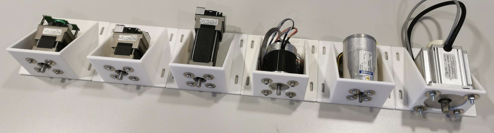
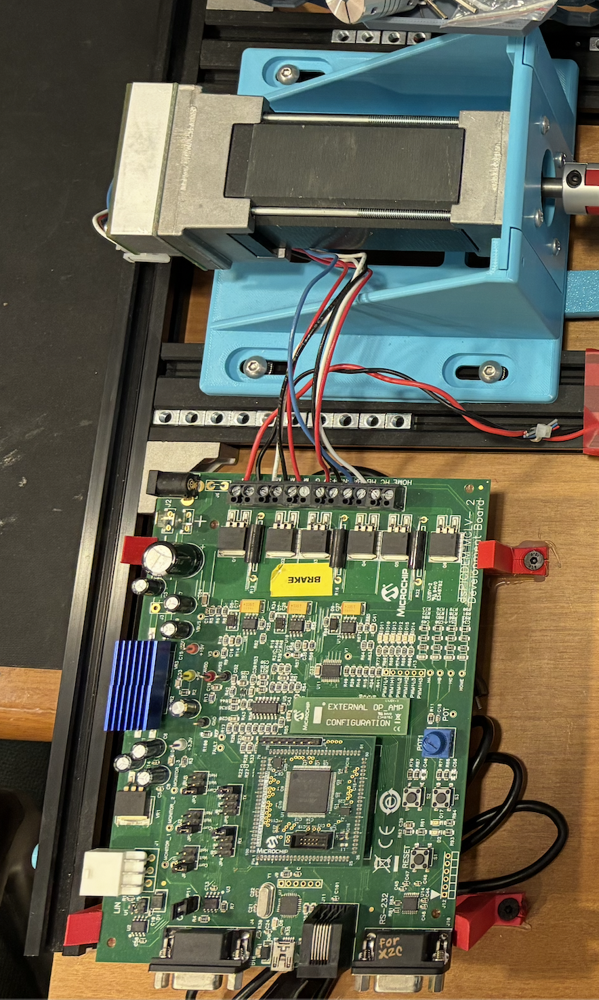
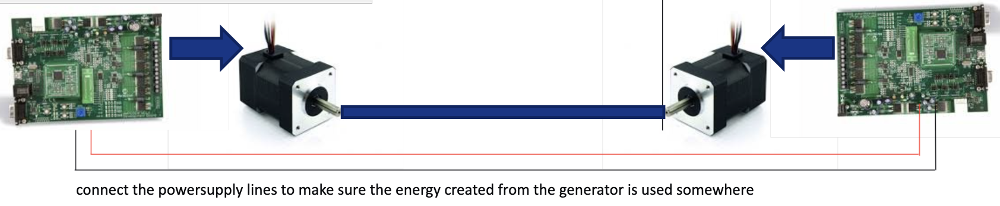
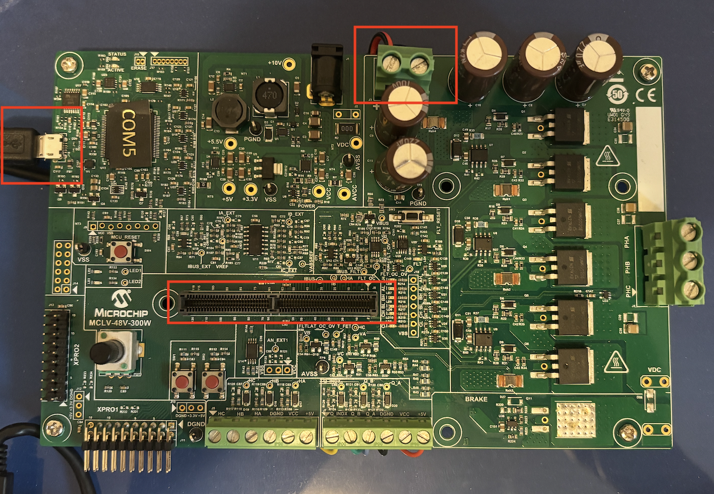
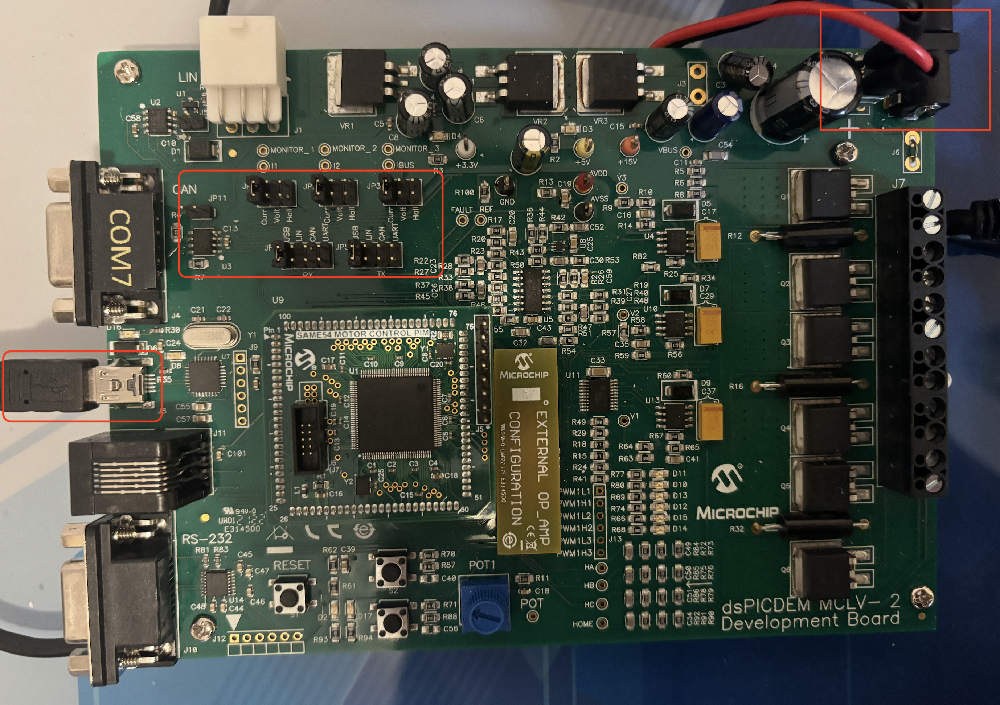

Make Your MC-Dyno
===================

.. contents::
   :local:
   :depth: 2

1. Introduction
---------------

This page intent is to guide you on the creation of your first MC-Dyno project.
The MC-Dyno proposed here, is the cheapest and easiest assembly that can be done
to get a working MC-Dyno setup.
You can use this page as a guide even if you have a different motor, a different
controller board and/or different motor holders.

This page focuses on the dynamometer (dyno) side only. For the motor side, see
:doc:`Motor Side (Device Under Test) <Device_Under_Test>`.

.. tip::

   In some instances you will find **tip** blocks like these... in here you
   will find tips and tricks on how to improve or "hack" the MC-Dyno for your
   specific needs.

.. warning::

   Warning blocks are not decoration. If you ignore them, your MC-Dyno may
   respond with mysterious smoke. Read carefully--future-you will thank present-you.
   This warning has already saved several MC-Dyno projects...
   
All of the files and links that are required during the build are available here. 
These are mainly 3D models and source code.

Once you start following the different chapters, open the corresponding files and
links to have all of the required files handy.

The content might be updated over time. Legacy code will still be available in the **legacy** folder 
where the legacy files will be organized by date when they where out-commissioned.

1.1 Hardware
~~~~~~~~~~~~

.. admonition:: For a smooth MC-Dyno build...

   If you want the most up-to-date dyno-side hardware that is currently used in the majority
   of the **MC-Dyno projects** is: 

   - One `MCLV-48V-300W Development Board <https://www.microchip.com/en-us/development-tool/ev18h47a>`_ for the Dynamometer side (preferred, replaces MCLV-2)
   - One `AC300022 - 24V 3-PHASE BRUSHLESS DC MOTOR WITH ENCODER <https://www.microchip.com/en-us/development-tool/ac300022>`_ for the Dynamometer side
   - If you already have a `MCLV-2 Development Board <https://www.microchip.com/en-us/development-tool/dm330021-2>`_, you can use it for the Dynamometer side instead.
   - If you use the `MCLV-2 Development Board <https://www.microchip.com/en-us/development-tool/dm330021-2>`_ for communicating with the PC, reading data and controlling the dynamometer, an USB to RS232 board is suggested, this is the one used in the majority of the MC-Dyno Projects: `MCP2200 USB TO RS232 DEMO BOARD <https://www.microchip.com/en-us/development-tool/mcp2200ev-vcp>`_

**Required hardware (Dyno side)**

- One `MCLV-48V-300W Development Board <https://www.microchip.com/en-us/development-tool/ev18h47a>`_ (preferred) or one `MCLV-2 Development Board <https://www.microchip.com/en-us/development-tool/dm330021-2>`_ for the dynamometer controller.
- One `AC300022 - 24V 3-PHASE BRUSHLESS DC MOTOR WITH ENCODER <https://www.microchip.com/en-us/development-tool/ac300022>`_ for the dynamometer side. 
- One `3A 24V Power Supply <https://www.microchipdirect.com/dev-tools/AC002013>`_
- Flexible aluminum jaw shaft coupling (if the above suggested motors are used, then 8mm bore should be selected).
- Eight M4 x 10 mm hex-socket screws
- 3D printed brackets, which can be found in the `3Dparts <https://github.com/ImpressiveTaste/Dyno-MCHP-Repository-WIP/tree/main/3Dparts>`_ folder (OpenSCAD + STL).
- Wood mounting base or 4 (20x20) T-slot aluminum profiles, minimum length 500 mm
- For T-slot mounting Eight M5 socket-head cap screws (M5 SHCS) - 16 mm
- For T-slot mounting Eight M5 T-slot nuts
- Windows PC running Windows 10.

**Alternative Hardware (Dyno side)** 

- For High Voltage Motor Testing - One `MCHV-230V-1.5kW Development Board <https://www.microchip.com/en-us/development-tool/ev78u65a>`_ for the dynamometer side.
- `MCLV-2 Development Board <https://www.microchip.com/en-us/development-tool/dm330021-2>`_ can be used instead of the MCLV-48V-300W for the dynamometer side, performance is very similar. 
- An alternative motor that can be used for the Dynamometer side is the `ACT57BLF02 Motor <https://www.act-motor.com/brushless-dc-motor-57blf-product/>`_, actually any motor that has a QEI/ABZ Encoder can be used by then doing the correct modificaiton to the code to support it.

1.2 Software needed
~~~~~~~~~~~~~~~~~~~

- Scilab 6.1.1 (installation directory: https://www.scilab.org/download/previous-versions); newer versions will not work. (Scilab 2023.1.0 should also work).
- X2C 6.4 (Installation tutorial: https://www.youtube.com/watch?v=H_EVY1D95eY)  
- MPLAB X IDE and MPLAB X IPE (installation: https://www.microchip.com/en-us/tools-resources/develop/mplab-x-ide)
- XC-DSC 3.21, which you can install during process of installation of MPLAB X
- MPLAB XC32 5.00 , which you can install during process of installation of MPLAB X

2. Assembling the hardware
--------------------------

In this section the steps to build the MC-Dyno dynamometer side will be described. 
This is the **easiest possible MC-Dyno** you can make, but as you saw in the home page, you are free to play around
and make the MC-Dyno that best suits your needs.

Before starting this guide, navigate to the file section `3Dparts <https://github.com/ImpressiveTaste/Dyno-MCHP-Repository-WIP/tree/main/3Dparts>`_ 
and **3D print the motor mounts** for the dynamometer side motor used. For the dynamometer side, use 
`Hurst_blue_wedge_V1_00.stl <https://github.com/ImpressiveTaste/Dyno-MCHP-Repository-WIP/blob/main/3Dparts/STL/Hurst_blue_wedge_V1_00.stl>`_. 
Print one bracket for the dynamometer motor. If you are also building the DUT side, the ACT57BLF bracket is listed on the
:doc:`Motor Side (Device Under Test) <Device_Under_Test>` page.
There are two bracket sizes available: small for portable demonstrators (blue wedge) and standard 
size (unified). Before printing, decide the motor brackets versions that matches best your setup.
You can also find the **openSCAD files for the brackets**
in there, so if you would like to **modify** this model to fit a **different motor**, you're welcome to do so. 

   Some of the Many Unified Motor Brackets

You can print this model in PLA or PETG and make sure to set the infill to 100%. 
You don't need to enable any supports.

2.1 Step 1: Mount Dynamometer Motor to 3D printed braket, align and fix
~~~~~~~~~~~~~~~~~~~~~~~~~~~~~~~~~~~~~~~~~~~~~~~~~~~~~~~~~~~~~~~~~~~~~~~

As a first step, mount the dynamometer motor in the **mounting bracket** that you have 3D printed. 

After that, fix the motor bracket to the T-Slot or your base support. 

If you are using different motors be sure to make the brackets in such a way that the motor
shafts are aligned. This is very important. Align the dyno motor shaft with the DUT motor shaft
using the shaft coupler to help you align them. 

Fix everything by tightening the different screws. If the shaft coupler spins freely, then the "hand alignment process" was
correct, if you see wiggle or that the shaft requires different forces in different positions to rotate, that might mean that
the motor shafts are not completely aligned. If that happens please untighten, move the brackets as needed and tighten
the screws needed to guarantee the best alignment possible. 

   Standard Dynamometer Side

.. tip::

   The shaft coupler can handle some small misalignment but will add unnecessary force to the Motor
   shafts, making the control not reliable, for this reason try to ensure shaft alignment between motors.

2.2 Setup Boards and wire them to the motors
~~~~~~~~~~~~~~~~~~~~~~~~~~~~~~~~~~~~~~~~~~~~

.. warning::

   To avoid the Dynamometer to destroy itself, it's **mandatory** to have a power sink 
   for the DC-link voltage. Best way is to **connect both DC link boards together**. 
   **If you are doing a default MC-Dyno configuration, only use one power supply and then connect the two boards
   together to share the power from the power supply, this will allow for sink of exceeding power in the motor that
   requires energy and keep the DC-Link voltage regulated.**

   To avoid the Dynamometer to destroy itself, it's mandatory to have a power sink for the DC-link voltage. Best way is to connect both DC link boards together.

**2.2.1 Wiring the Dynamometer side**

For wiring the Hurst Motor, use the standard connectors provided in the box. The cables you will want are shown in the picture below. 

Feel free to cut the not used cables like in the picture.

.. list-table::
   :widths: 50 50
   :align: center

   * - .. figure:: _static/images/HurstMotorWiring.png
          :alt: HurstMotorWiring
          :width: 95%

          Hurst Motor Wiring
     - .. figure:: _static/images/MCLV2Wiring.png
          :alt: MCLV-2 wiring
          :width: 95%

          MCLV-2 wiring

**2.2.2 Configure MCLV-48V-300W (Preferred)**

The MCLV-48V-300W is the current dyno-side board and replaces the MCLV-2 for new builds.
Use it if you are starting a new dyno build. If you already have an MCLV-2 board, use that one instead
(see the next section).

   MCLV-48V-300W board configuration

**2.2.3 Configure MCLV-2 (Legacy)**

For the MCLV-2 you will need the `ATSAM54P20A External OpAmp PIM board <https://www.microchip.com/en-us/development-tool/ma320207>`_.
Other than that you will need to configure the board like shown in the picture below (make sure all jumpers in your board are placed in the same way as in the reference picture):

   MCLV-2 board configuration

In this case, we are connecting the 24Volt power source to this board, and then going out with two cables (positive and negative) from the MCLV-2 board to the DUT board
to share the DC-Link and guaranteeing not being able to dissipate the energy created while braking the motor. The same done here, **has to be done** also with the MCLV-48V-300W board.

3. Load the software
--------------------

Dyno-side firmware is provided for both boards in this repository:

- ``MCDyno/mc_foc_dyno_same54_mclv48v300w`` (preferred for new builds, MCLV-48V-300W)
- ``MCDyno/mc_foc_dyno_same54_mclv2`` (use this if you already have an MCLV-2)

4. Run the MC-Dyno - step-by-step
-----------------------------------

After both sides are assembled and programmed, follow the runtime steps in :doc:`usage`.
