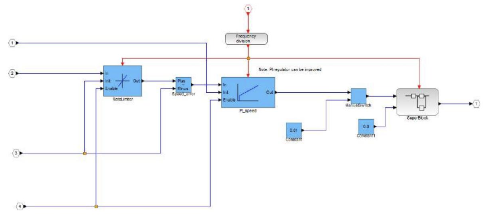
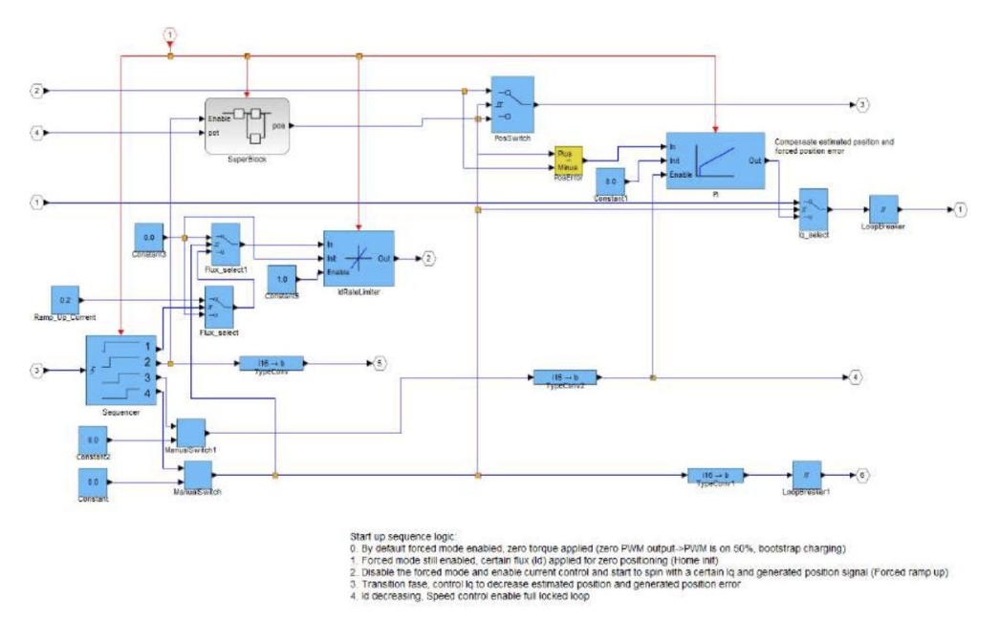
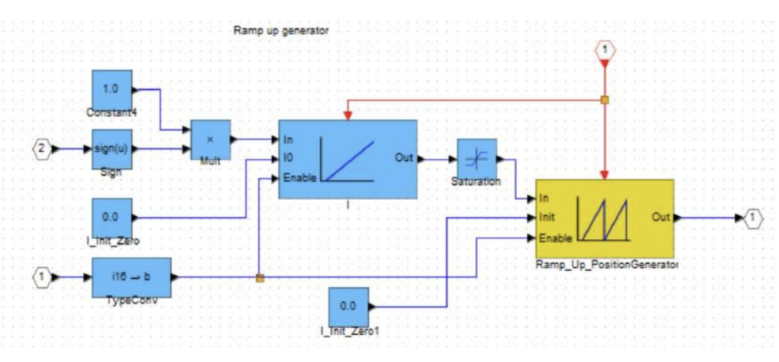
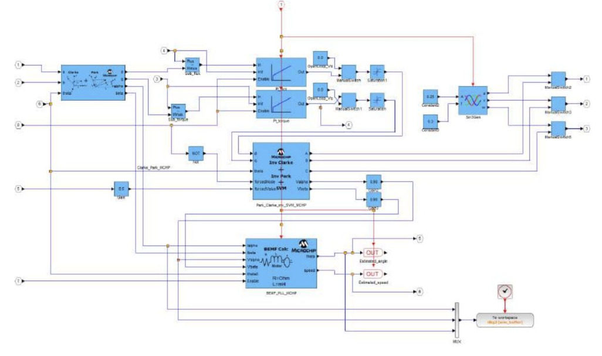

The Theory behind the MC-Dyno
==============================

.. contents::
   :local:
   :depth: 2

1. Overview
-----------

The MC-Dyno is a motor dynamometer built from two motor-control systems coupled
shaft-to-shaft: a motor-under-test (DUT) and a dynamometer motor that applies a
controlled load. The dyno motor acts as an active brake, allowing you to command
load profiles and observe how the DUT responds in speed, torque, and current.

1.1 Dyno vs DUT Roles
~~~~~~~~~~~~~~~~~~~~~

- **DUT side:** runs the control algorithm you want to test (speed or torque control).
- **Dyno side:** applies a controllable mechanical load to the DUT motor.
- **Mechanical coupling:** transfers torque between the two machines so the dyno can
  load the DUT and absorb power.

1.2 Energy Flow and the DC Link
~~~~~~~~~~~~~~~~~~~~~~~~~~~~~~~

In a typical setup both control boards share a single DC power supply. When the
DUT motor produces power, the dyno side absorbs that mechanical energy and the
system returns electrical energy to the shared DC link. Using a single supply and
shared DC link keeps the bus voltage stable during regenerative operation.

2. Control Concepts
-------------------

2.1 Closed-Loop Control
~~~~~~~~~~~~~~~~~~~~~~~

The demo uses closed-loop control to regulate speed and torque. On the DUT side
this shows how the controller reacts to commanded setpoints and load changes. On
the dyno side it provides the load torque profile that the DUT must overcome.

For the closed loop control it uses a FOC scheme. 

Here are some details on some of the different blocks: 

**Speed_pi block**

This diagram represents the speed regulation block through a PI (Proportional-Integral) controller. The main function
of this block is to keep the speed of the permanent magnet motor (PMSM) compliant with the reference value,
compensating for any differences.

Input:

- Reference speed (``omega_ref``): the desired speed command.
- Real speed (``omega_real``): measured actual motor speed.
- Speed error (``omega_ref - omega_real``): the error used by the PI controller to compute corrective action.

Output:

- Control signal (``Tcmd``): PI output sent to the motor to correct speed by adjusting torque-producing current.

**Startup Block**

The diagram shows the block that manages the start of the engine control system. Its main function is to ensure
safe engine start, verifying that all conditions are ready before activating the FOC (Field-Oriented Control) control in
normal mode.

Input:

- Startup signal: indicates when the system should start operating, activating the startup process.
- Initial rotor position: required to correctly initialize the control.
- Voltage and current parameters: used to monitor the motor status and confirm it is ready to start.

Output:

- FOC enable signal: sent when startup is complete to enable normal control.
- Starting current: a suitable current to start the motor without overcurrent or instability.

**Superblock Subsystem**

The subsystem shown in the image manages the generation of a ramp up signal for controlling the position or speed
of the motor. It is used to obtain a gradual and controlled start. The detailed operation of the main blocks is described
below:

- Sign and Multiplier Block: input signal 2 passes through a Sign block to determine its sign, then is multiplied by a
  constant (1.0) to maintain the correct direction.
- Ramp Generator: produces a signal increasing linearly over time, with an enable parameter to activate or deactivate it.
- Ramp Up Position Generator: creates a controlled position profile for engine start, reducing sudden movements.
- Initializations and Conversions: input 1 is converted and initialized to zero to establish an initial reference condition.
- System Protection: the Saturation block limits signal values to prevent overloads and dangerous movements.
- Output: the generated control signal used for controlling a motor or mechanical system.

**Clarke_Park_MCHP Block**

This diagram represents the Clarke-Park transformation block, which performs two important
mathematical conversions for the vector control of the motor. Its role is fundamental to go from
ABC coordinates (three-phase) to dq coordinates (synchronized with the rotor), facilitating the
control of torque and magnetic flux.

Input:

- Three-phase currents (``Ia``, ``Ib``, ``Ic``): measured motor phase currents, transformed for FOC control.
- Rotor angle (``theta``): rotor position angle required for the Park transform, synchronizing control with the rotor.

Output:

- Currents in dq coordinates (``Id``, ``Iq``): allow direct control of magnetic flux (``Id``) and torque (``Iq``).

2.2 Load Profiles
~~~~~~~~~~~~~~~~~

Load profiles are used to demonstrate dynamic behavior. Examples include:

- **Constant torque** for a steady load.
- **Trapezoidal load** for time-varying torque changes.
- **Unbalanced / disturbance cases** to highlight transient response.

3. What the Demo Shows
----------------------

- Stable closed-loop control in speed and torque.
- The DUT response to dynamic load profiles.
- How current changes under added disturbance (useful for predictive-maintenance
  concepts and anomaly detection demonstrations).

4. Observability and Scaling
----------------------------

The system exposes internal signals (currents, torque, speed) through the scope
interface. Use the model report scaling factors to convert fixed-point values to
real units when presenting data.

**Typical signals to watch**

- Quadrature current (torque-producing current)
- Direct current (flux component)
- Phase current
- Electrical or mechanical speed
- Dyno torque (if available in the model)

5. Operating Envelope and Safety
--------------------------------

- Keep within the board and motor ratings.
- Maintain proper shaft alignment to minimize mechanical stress.
- Use a single DC supply and shared DC link to avoid overvoltage during braking.
- Apply disturbances only at low speed and under controlled conditions.
